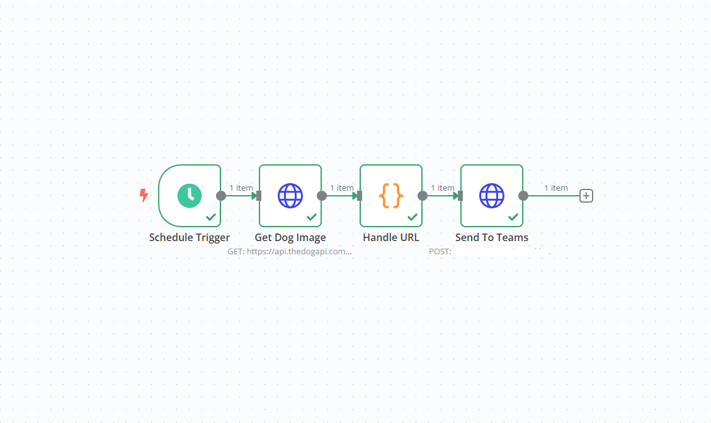

# N8N Postgres Send Image Teams

Deploy n8n and write a workflow to automatically call an API every day to fetch dog images and send them to Microsoft Teams.  

## Overview

- Tool: n8n v1.82.3


## Run

### Run Docker
```
docker compose up -d
```
server running at `http://localhost:5678`.  

## UI

1. Create a new workflow and import it by file: [dog_image.json](./dog_image.json).
2. Use the `incoming webhook` on Microsoft Teams to get the API URL and update it in the node.
3. Activate the workflow.




## References

- [The Dog API](https://thedogapi.com/)